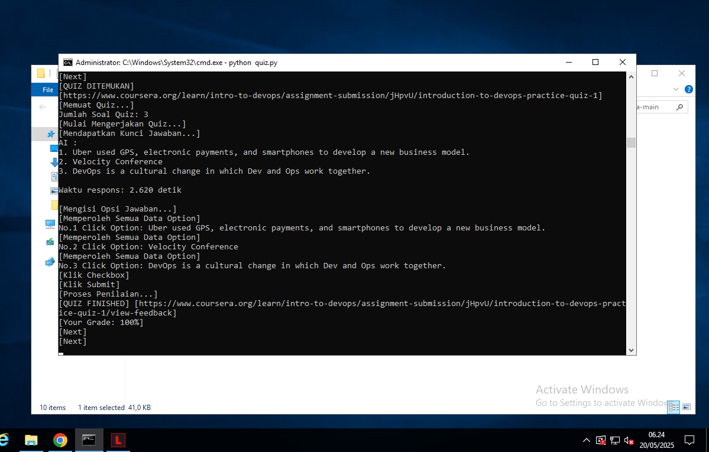

# Automated Coursera Course Bot

## [Bot 100% Marked Video and Reading Module]

This Python script automates interactions with Coursera courses, including marking videos and readings as completed, and navigating through course content. It supports **Remote Desktop Protocol (RDP)** usage on GitHub and uses Selenium for browser automation.

---

## Features
- **Automated Login**: Login manually once and save cookies for future sessions.
- **Course Navigation**: Automatically navigate through course modules, video, and mark items as completed.
- **Quiz Handling**: The `quiz.py` and `quizeng.py` scripts attempt to handle quizzes automatically using various methods.
- **Multi-course Support**: Process multiple courses simultaneously by inputting an array of course links.
- **Hotkey Integration**: Use `Ctrl + C` to stop the automation loop.

---

## CREATE RDP USING GITHUB
### Pakai RDP agar jaringannya fast dan ngga lambat
You can check tutorial on my repository about [Free RDP Github](https://github.com/fikriaf/FREE-RDP).
### And then, run RDP and install requirements on below into the RDP
---
## Usage Instructions
1. Clone the Repository
   ```bash
   git clone https://github.com/fikriaf/AutoCoursera.git
   cd AutoCoursera
   ```
2. Configure User Credentials
   Update the following variables in the script `env.py`:
   ```python
   USERNAME = "your-email@example.com"
   PASSWORD = "your-password"
   ```
3. Run the Script
   - Basic
   ```bash
   python coursera.py
   ```
   - Quiz
   ```bash
   python quiz.py
   ```

5. Input Course Links
   When prompted, input the Coursera course links as a space-separated list:
   ```text
   Input link course (Banyak link, pisahkan dengan spasi): link1 link2 link3
   ```
   ## NOTE:
   Use the link at the beginning of the course/introduction, for example like this:
   <br>https://www.coursera.org/learn/introduction-to-databases/home/module/1
   <br>Or
   <br>https://www.coursera.org/learn/introduction-to-databases/home/module/2
   <br>etc.
---

## Hotkey Usage
Stop Automation: Press `Ctrl + C` to stop the current process.
## Limitations
Requires manual login for the first run to save cookies.
Configured specifically for Coursera courses; adjust XPath or CSS selectors if UI changes.

---

# DISCLAIMER!!!
```hash
Disclaimer of Liability:
This script is provided for educational and informational purposes only.
The author is not responsible for any misuse, damage, or legal consequences
that may arise from the use of this software. Users are responsible for
complying with all applicable laws and terms of service of the platforms
involved.
```
